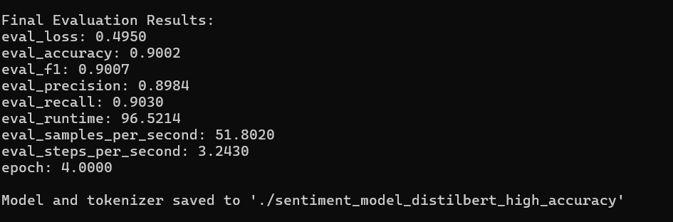

# NLP Sentiment Analysis: Fine-Tuning DistilBERT on IMDB Reviews

This repository contains the code and documentation for an NLP project focused on sentiment analysis. The primary goal was to fine-tune a `distilbert-base-uncased` model on the IMDB Movie Reviews dataset to achieve a classification accuracy of over 90%.

The project covers the full machine learning workflow, including data preprocessing, GPU-accelerated model training with PyTorch and Hugging Face Transformers, performance optimization, and final evaluation.

---

## Final Results

The model was trained on a subset of 15,000 reviews and evaluated on 5,000 reviews, successfully surpassing the 90% accuracy target.

| Metric    | Score  |
| :-------- | :----- |
| Accuracy  | 90.02% |
| F1-Score  | 90.07% |
| Precision | 89.84% |
| Recall    | 90.30% |



---

## Project Structure

-   `sentiment_analysis.pdf`: A detailed report answering the assignment questions regarding dataset preparation, prompt engineering, model evaluation, and troubleshooting.
-   `sentiment_analysis.py`: The main Python script to train and fine-tune the model. Running this script will generate the final model artifacts.
-   `predict.py`: A script to load the fine-tuned model and perform sentiment analysis on new, user-provided text.
-   `requirements.txt`: A list of all necessary Python packages to run the project.
-   `results.png`: The screenshot of the final evaluation metrics.
-   `sentiment_model_distilbert_high_accuracy/`: This folder will be created by `sentiment_analysis.py` and contains the final trained model. It is not included in this repository due to its size.

---

## Setup and Usage

### 1. Clone the Repository
```bash
git clone <your-repository-url>
cd <repository-name>
```

### 2. Create and Activate a Virtual Environment
It is highly recommended to use a virtual environment to manage dependencies.

```bash
# Create the environment
python -m venv venv

# Activate on Windows
.\venv\Scripts\activate

# Activate on macOS/Linux
source venv/bin/activate
```

### 3. Install Dependencies
Install all the required packages using the `requirements.txt` file. For GPU support, ensure you have a compatible NVIDIA driver and CUDA Toolkit installed.

```bash
# Install PyTorch for CUDA 12.1 first
pip install --force-reinstall torch torchvision torchaudio --index-url [https://download.pytorch.org/whl/cu121](https://download.pytorch.org/whl/cu121)

# Install the rest of the packages
pip install -r requirements.txt
```

### 4. Train the Model
Run the main training script. This will download the dataset, preprocess the text, fine-tune the model, and save the final artifacts to the `sentiment_model_distilbert_high_accuracy` directory. This process is computationally intensive and is best run on a machine with a dedicated NVIDIA GPU.

```bash
python sentiment_analysis.py
```

### 5. Run Predictions
Once the model is trained, you can use the prediction script to classify the sentiment of any movie review.

```bash
python predict.py
```
The script will first test two example sentences and then prompt you for your own input.
